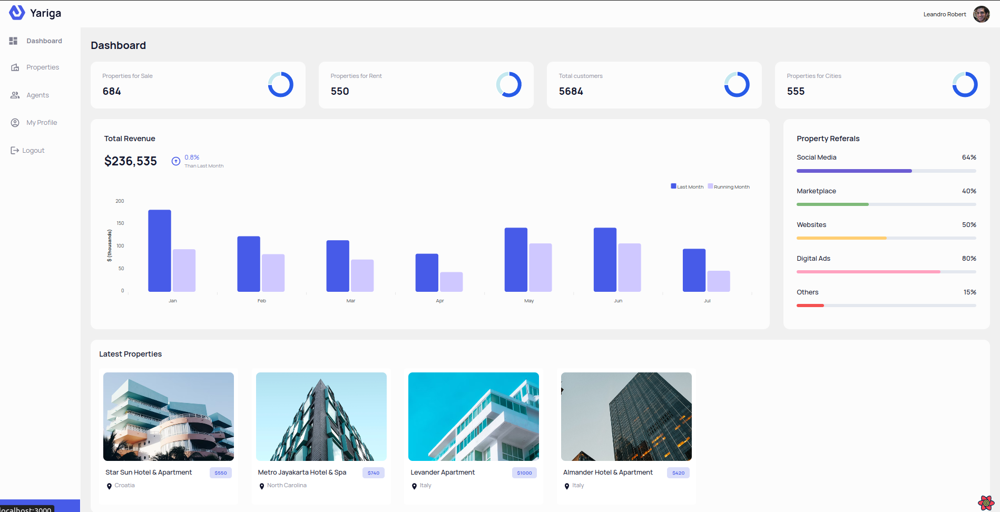

# Refine Dashboard App
## Project Demo
🔵 [Live demo](https://refine-dashboard-lr.netlify.app/) 🔵

## Description
A mockup project to simulate a real admin dashboard, with properties to rent, similar to Airbnb and similar real apps.

## Features
- Allow to login with Google Auth
- CRUD operations with properties
- Admin dashboard to reflect important data

## Technologies Used
- NextJS
- Node.js
- Express
- MongoDB
- Refine
- TailwindCSS

## Credits
Tutorial on YouTube by [JavaScript Mastery](https://www.youtube.com/watch?v=k4lHXIzCEkM)